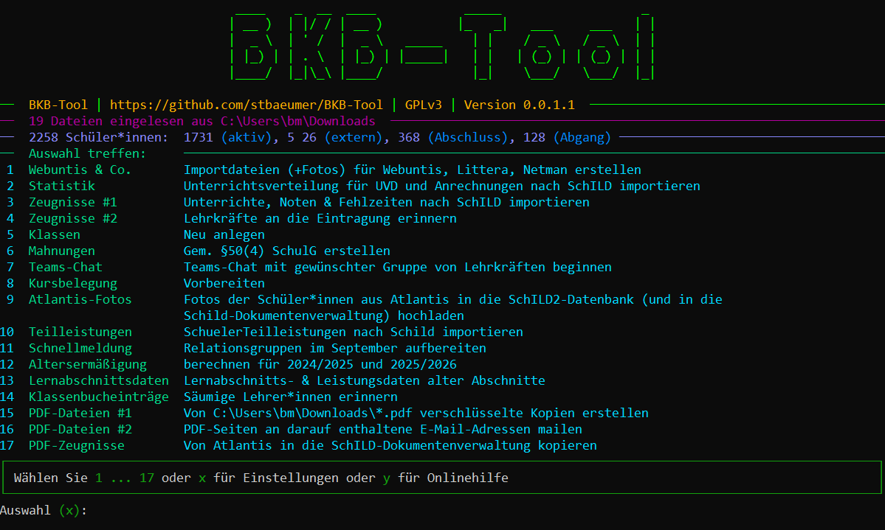

# BKB-Tool

                   ____    _  __  ____            _____                   _ 
                  | __ )  | |/ / | __ )          |_   _|   ___     ___   | |
                  |  _ \  | ' /  |  _ \   _____    | |    / _ \   / _ \  | |
                  | |_) | | . \  | |_) | |_____|   | |   | (_) | | (_) | | |
                  |____/  |_|\_\ |____/            |_|    \___/   \___/  |_|
                                                                            
────────────────  v0.0.1.1 | https://github.com/stbaeumer/BKB-Tool | GPLv3  ─────────────────

──  BKB-Tool | https://github.com/stbaeumer/BKB-Tool | GPLv3 | Version 0.0.1.2  ─────────────
──  19 Dateien eingelesen aus C:\Users\bm\Downloads  ────────────────────────────────────────
──  2258 Schüler*innen:  1731 (aktiv), 5 26 (extern), 368 (Abschluss), 128 (Abgang) ─────────
──  Auswahl treffen:     ────────────────────────────────────────────────────────────────────
 1  Webuntis & Co.       Importdateien (+Fotos) für Webuntis, Littera, Netman erstellen
 2  Statistik            Unterrichtsverteilung für UVD und Anrechnungen nach SchILD 
                         importieren
 3  Zeugnisse #1         Unterrichte, Noten & Fehlzeiten nach SchILD importieren
 4  Zeugnisse #2         Lehrkräfte an die Eintragung erinnern
 5  Klassen              Neu anlegen
 6  Mahnungen            Gem. §50(4) SchulG erstellen
 7  Teams-Chat           Teams-Chat mit gewünschter Gruppe von Lehrkräften beginnen
 8  Kursbelegung         Vorbereiten
 9  Atlantis-Fotos       Fotos der Schüler*innen aus Atlantis in die SchILD2-Datenbank (und 
                         in die Schild-Dokumentenverwaltung) hochladen
10  Teilleistungen       SchuelerTeilleistungen nach Schild importieren
11  Schnellmeldung       Relationsgruppen im September aufbereiten
12  Altersermäßigung     berechnen für 2024/2025 und 2025/2026
13  Lernabschnittsdaten  Lernabschnitts- & Leistungsdaten alter Abschnitte
14  Klassenbucheinträge  Säumige Lehrer*innen erinnern
15  PDF-Dateien #1       Von C:\Users\bm\Downloads\*.pdf verschlüsselte Kopien erstellen
16  PDF-Dateien #2       PDF-Seiten an darauf enthaltene E-Mail-Adressen mailen
17  PDF-Zeugnisse        Von Atlantis in die SchILD-Dokumentenverwaltung kopieren
┌───────────────────────────────────────────────────────────────────────────────────────────┐
│ Wählen Sie 1 ... 17 oder x für Einstellungen oder y für Onlinehilfe                       │
└───────────────────────────────────────────────────────────────────────────────────────────┘
Auswahl (x):

